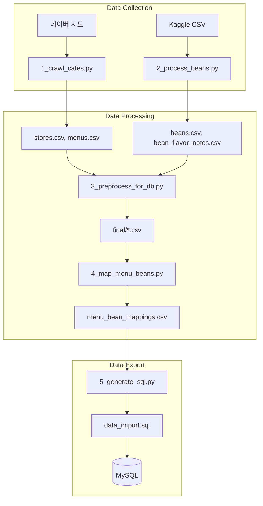

# Cochelin-Data

서울 스페셜티 카페 데이터 수집 및 처리 파이프라인

## 목차

- [Quick Start](#quick-start)
- [요구사항](#요구사항)
- [프로젝트 개요](#프로젝트-개요)
- [데이터 파이프라인](#데이터-파이프라인)
- [스크립트 상세](#스크립트-상세)
- [데이터베이스](#데이터베이스)
- [SCA Flavor Wheel](#sca-flavor-wheel)
- [폴더 구조](#폴더-구조)
- [트러블슈팅](#트러블슈팅)

---

## Quick Start

```bash
# 1. 의존성 설치
pip install -r requirements.txt

# 2. SQL 생성 (이미 처리된 데이터 사용)
python scripts/5_generate_sql.py

# 3. DB Import
mysql -u root -p <database> < sql/schema.sql
mysql -u root -p <database> < sql/flavor_prod.sql
mysql -u root -p <database> < sql/data_import.sql
```

> 전체 파이프라인을 처음부터 실행하려면 [전체 실행](#전체-실행) 참고

---

## 요구사항

### 시스템 요구사항

| 항목   | 버전      | 비고         |
| ------ | --------- | ------------ |
| Python | 3.9+      | 3.10 권장    |
| Chrome | 최신 버전 | 크롤링용     |
| MySQL  | 8.0+      | 데이터 저장용 |

### 환경 변수

```bash
# LLM 처리용 (2_process_beans.py에서 사용)
export OPENAI_API_KEY="your-api-key"

# SSAFY GMS 프록시 사용 시 (선택)
export OPENAI_API_BASE="https://gms.ssafy.io/gmsapi/api.openai.com/v1"
```

### 의존성 설치

```bash
pip install -r requirements.txt
```

---

## 프로젝트 개요

커슐랭(Cochelin) 서비스를 위한 스페셜티 카페 데이터셋 구축 프로젝트입니다. 두 가지 데이터 소스를 결합하여 카페-메뉴-원두-플레이버의 연결 구조를 생성합니다.

### 데이터 소스

| 소스              | 수집 방법        | 데이터 내용                                          |
| ----------------- | ---------------- | ---------------------------------------------------- |
| **네이버 지도**   | Selenium 크롤링  | 서울 스페셜티 카페 정보 (가게명, 주소, 메뉴, 가격)   |
| **[Kaggle Dataset](https://www.kaggle.com/datasets/hanifalirsyad/coffee-scrap-coffeereview)** | CSV 다운로드     | 원두 평가 데이터 (원산지, 품종, 로스팅, 향미 설명, 점수) |

> Kaggle 데이터셋은 [CoffeeReview.com](https://www.coffeereview.com/)의 원두 리뷰 데이터를 크롤링하여 1차 정제한 데이터입니다.

### 데이터 통계

| 테이블             | 레코드 수 | 설명                 |
| ------------------ | --------- | -------------------- |
| roasteries         | 231       | 로스터리 정보        |
| stores             | 246       | 카페 매장 정보       |
| beans              | 1,000     | 커피 원두 정보       |
| menus              | 1,355     | 메뉴 정보 (커피만)   |
| bean_flavor_notes  | 4,823     | 원두별 플레이버 노트 |
| menu_bean_mappings | 270       | 메뉴-원두 매핑       |

### 기술 스택

| 분류              | 기술                       | 용도                                     |
| ----------------- | -------------------------- | ---------------------------------------- |
| **크롤링**        | Selenium, WebDriver Manager | 네이버 지도 동적 페이지 크롤링           |
| **데이터 처리**   | Pandas                     | CSV 파싱, 데이터 정제, 변환              |
| **LLM**           | OpenAI GPT-4o-mini         | 원두 향미 설명 → 구조화된 JSON 변환      |
| **RAG**           | LangChain                  | LLM 프롬프트에 SCA Flavor Wheel 컨텍스트 주입 |
| **데이터베이스**  | MySQL                      | 최종 데이터 저장                         |

---

## 데이터 파이프라인



### 전체 실행

```bash
# 1. 네이버 지도에서 카페 크롤링
python scripts/1_crawl_cafes.py

# 2. 원두 데이터 전처리 (GPT-4o-mini 사용)
export OPENAI_API_KEY="your-key"
python scripts/2_process_beans.py

# 3. DB 스키마에 맞게 전처리
python scripts/3_preprocess_for_db.py

# 4. 메뉴-원두 매핑 생성
python scripts/4_map_menu_beans.py

# 5. SQL 파일 생성
python scripts/5_generate_sql.py

# 6. (선택) 추천용 점수 데이터
python scripts/6_import_bean_scores.py
```

### DB Import

```bash
# 스키마 생성
mysql -u <user> -p <database> < sql/schema.sql

# Flavor 데이터 (SCA Flavor Wheel)
mysql -u <user> -p <database> < sql/flavor_prod.sql

# 전체 데이터
mysql -u <user> -p <database> < sql/data_import.sql

# 추천 시스템 (선택)
mysql -u <user> -p <database> < sql/scores_and_preferences.sql
```

---

## 스크립트 상세

### 1_crawl_cafes.py - 카페 크롤링

네이버 지도에서 서울 스페셜티 카페 정보를 수집합니다.

#### 크롤링 전략

- 검색어: 지역별 스페셜티/로스터리 키워드 조합 (50개+)
- 데이터 추출: `window.__APOLLO_STATE__`에서 JSON 파싱
- 봇 감지 우회: `webdriver` 속성 숨김, 랜덤 대기 시간

#### 메뉴 필터링 (블랙리스트 방식)

비커피 메뉴만 제외하고 나머지는 모두 포함:

- 디저트: 케이크, 쿠키, 스콘 등
- 차류: 녹차, 홍차, 허브티 등
- 가격 범위: 2,000원 ~ 15,000원

### 2_process_beans.py - 원두 전처리

Kaggle 원두 데이터를 GPT-4o-mini로 정제하고 SCA Flavor Wheel에 매핑합니다.

#### 입력 예시

```text
로스터리: Blue Bottle Coffee
이름: Ethiopia Yirgacheffe Konga
향미 설명: Floral, bergamot, stone fruit, honey sweetness...
```

#### 출력 예시

```json
{
  "name": "에티오피아 예가체프 콩가",
  "country": "에티오피아",
  "variety": "Heirloom",
  "processing_method": "Washed",
  "flavor_ids": [90203, 10307, 80104]
}
```

#### 비용 최적화

- 1,000개 랜덤 샘플링
- 10개마다 중간 저장
- 0.3초 Rate limiting

### 4_map_menu_beans.py - 메뉴-원두 매핑

#### 매핑 전략

1. 메뉴명에서 국가/지역 추출 → 해당 국가 대표 원두 매핑
2. 가게 description에서 국가 추출 → 전체 메뉴에 매핑

#### 지원 국가

에티오피아, 콜롬비아, 케냐, 과테말라 등 17개국

### 5_generate_sql.py - SQL 생성

CSV 파일을 MySQL INSERT문으로 변환합니다.

#### 메뉴 카테고리 자동 분류 (우선순위 순)

| 순위 | 카테고리   | 매칭 키워드                  |
| ---- | ---------- | ---------------------------- |
| 1    | FLAT_WHITE | 플랫화이트, flat white       |
| 2    | CAPPUCCINO | 카푸치노, cappuccino         |
| 3    | COLD_BREW  | 콜드브루, 더치커피           |
| 4    | HAND_DRIP  | 핸드드립, 브루잉, 싱글오리진 |
| 5    | ESPRESSO   | 에스프레소, 아인슈페너       |
| 6    | AMERICANO  | 아메리카노, 롱블랙           |
| 7    | LATTE      | 라떼, 카페라떼, 모카         |

---

## 데이터베이스

### 주요 테이블

| 테이블             | 설명               | 비고                                             |
| ------------------ | ------------------ | ------------------------------------------------ |
| roasteries         | 로스터리           | id=1은 Admin Roastery (출처 미상)                |
| stores             | 카페 매장          | roastery_id FK                                   |
| beans              | 원두               | country, variety, processing_method, roasting_level |
| menus              | 메뉴               | category enum, store_id FK                       |
| menu_bean_mappings | 메뉴-원두 매핑     | N:M 관계                                         |
| bean_flavor_notes  | 원두-플레이버 매핑 | N:M 관계                                         |
| flavors            | SCA Flavor Wheel   | 3단계 계층 (parent_id)                           |

### 추천 시스템 테이블

| 테이블           | 설명                                           |
| ---------------- | ---------------------------------------------- |
| bean_scores      | 정규화된 감각 속성 (acidity, body, sweetness 등) |
| user_preferences | 사용자 취향 프로필                             |

---

## SCA Flavor Wheel

3단계 계층 구조의 커피 향미 분류 체계:

```text
Level 1 (대분류)     Level 2 (중분류)      Level 3 (소분류)
─────────────────────────────────────────────────────────
FRUITY (과일향)  →  BERRY (베리류)   →  BLUEBERRY (블루베리)
                    │                    RASPBERRY (라즈베리)
                    │
                    CITRUS (감귤류)  →  LEMON (레몬)
                                        ORANGE (오렌지)

FLORAL (꽃향)    →  FLORAL_SUB      →  JASMINE (자스민)
                                        ROSE (장미)

SWEET (단맛)     →  BROWN_SUGAR     →  HONEY (꿀)
                                        CARAMELIZED (캐러멜)
```

총 9개 대분류, 30개 중분류, 60개+ 소분류

---

## 폴더 구조

```text
Cochelin-Data/
├── scripts/
│   ├── 1_crawl_cafes.py        # 네이버 지도 크롤링
│   ├── 2_process_beans.py      # 원두 전처리 (GPT-4o-mini)
│   ├── 3_preprocess_for_db.py  # DB 스키마 맞춤 전처리
│   ├── 4_map_menu_beans.py     # 메뉴-원두 매핑
│   ├── 5_generate_sql.py       # CSV → SQL 변환
│   ├── 6_import_bean_scores.py # 추천용 점수 데이터
│   └── .deprecated/            # 미사용 스크립트
│
├── data/
│   ├── raw/                    # 원본 데이터
│   │   ├── coffee_clean.csv    # Kaggle 원두 데이터셋
│   │   └── stores.csv          # 크롤링된 카페 데이터
│   ├── beans/                  # 원두 처리 결과
│   ├── stores/                 # 가게/메뉴 처리 결과
│   ├── final/                  # DB Import용 최종 데이터
│   └── debug/                  # 디버그용 (flavors_rag.json 등)
│
├── sql/
│   ├── schema.sql              # DB 스키마 (DDL)
│   ├── flavor_prod.sql         # SCA Flavor Wheel 데이터
│   ├── scores_and_preferences.sql  # 추천 시스템 테이블
│   └── data_import.sql         # 생성된 INSERT문
│
└── requirements.txt            # Python 의존성
```

---

## 트러블슈팅

### Chrome/ChromeDriver 버전 불일치

```text
selenium.common.exceptions.SessionNotCreatedException:
Message: session not created: This version of ChromeDriver only supports Chrome version XX
```

**해결**: `webdriver-manager`가 자동으로 처리하지만, Chrome 업데이트 후 캐시 문제가 발생할 수 있음

```bash
# ChromeDriver 캐시 삭제
rm -rf ~/.wdm/drivers/chromedriver
```

### 네이버 지도 크롤링 차단

네이버는 robots.txt 및 봇 감지를 통해 빠른 요청을 차단합니다. 데이터가 수집되지 않거나 빈 결과가 반환되는 경우:

**해결**: 스크립트에 이미 적용된 대기 시간 전략:

- 페이지 로드 후 2~5초 랜덤 대기
- 검색어 간 3~7초 랜덤 대기
- 가게 상세 페이지 접근 시 1~3초 대기

```python
# 1_crawl_cafes.py에 적용된 패턴
time.sleep(random.uniform(2, 5))  # 페이지 로드 대기
time.sleep(random.uniform(3, 7))  # 검색어 간 대기
```

> 대기 시간을 줄이면 차단될 수 있으며, 전체 크롤링에 수 시간이 소요됩니다.

### API Rate Limit

2_process_beans.py 실행 중 Rate limit 오류 발생 시:

- 스크립트가 10개마다 자동 저장하므로 중단 후 재시작 가능
- `data/beans/beans_partial.csv`에서 이어서 처리

### MySQL Import 오류

```text
ERROR 1366 (HY000): Incorrect string value
```

**해결**: 데이터베이스 및 테이블 charset 확인

```sql
ALTER DATABASE <db_name> CHARACTER SET utf8mb4 COLLATE utf8mb4_unicode_ci;
```

---

## 특이사항

- **roastery_id = 1**: Admin Roastery (Kaggle 원두 등 출처 미상)
- **owner_id = 1**: 기본 관리자
- **Flavor 계층**: 자식 선택 시 부모는 자동 포함 (DB에서 처리)
- **메뉴 category**: Java enum과 동일한 문자열 값 사용
